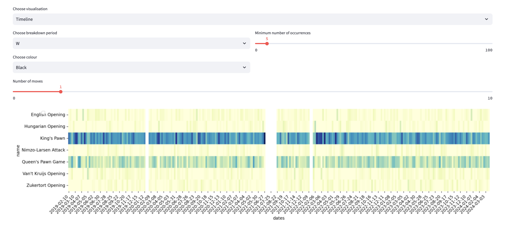

# chess-opening-analyser

A library meant to help the analysis and visualisation of a user's chess games, focussing on openings.

Currently supported chess platforms:
* chess.com

 Currently supported engines:
* Stockfish

## Setup
The analyser uses a chess analysis engine. Download Stockfish, and set the environment variable `STOCKFISH_DIR` to the directory containing it.

```bash
$ make install
```

## Running the analysis CLI
The analysis pipeline can also be run as a CLI tool to analyse all the games of a user.

```bash
$ poetry run python cli/analyse_openings.py --player-id <PLAYER-ID> --limit <LIMIT> --num-workers <NUM-WORKERS>
```

The results are saved locally in `tree.json`, which is the `Tree` object persisted to disk.

NOTE: running the analysis CLI involves calculating game-scores multiple times for each game.
Depending on the number of games and the machine running the CLI, this can take a while.

## Running the streamlit app

There's a streamlit app with a simple UI that helps with interacting with the openings data.

```bash
$ make vis
```

If the CLI has been run for the user, then the app will use the cached assets (saved games and tree persisted to disk). Otherwise it'll start analysis to create these assets.

The app has 3 pages that allow analysing the data from different aspects.

### 1) Timeline page
Shows a heatmap of the proportions of games played with the Opening for a time interval. Controls allow to change:
* breakdown period: Y (yearly), M (monthly), W (weekly) aggregation of the games played
* player colour when encountering the opening
* number of moves: at which move in the game was the opening played
* minimum number of occurrences: a threshold below which openings are filtered, if the max occurrence doesn't reach this in any of the time intervals



### 2) Opening strength
This page allows for an aggregated view of the openings.

The columns of the table:
* mean_following_game_scores: the mean scores 1 move after this opening
* mean_score_in_n_moves (currently `n=5`): the mean score `n` moves after this opening
* mean_results: average of game results after this opening (win: 1, draw: 0.5, lose: 0)


### 3) Single opening
This view allows to dive deeper into a single opening. Once selected, three visualisations are available:
* chess board with the opening state and arrows signalling the next moves. Green is the optimal move according to the engine, the greys are those of the user (opacity increases with the frequency of the move)
* a table or scatter-plot on the right allows understanding the following moves
* a Sankey-diagram places this opening in context to understand which openings led to it, and where the user's games proceeded to


<table>
  <tr>
    <td>
      
    </td>
    <td>
      
    </td>
  </tr>
</table>
